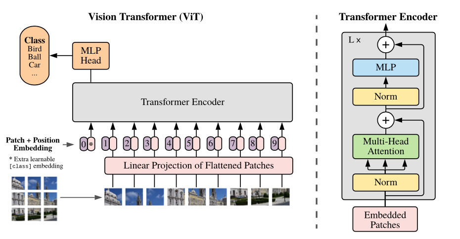
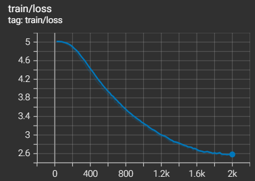
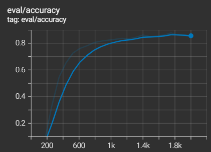
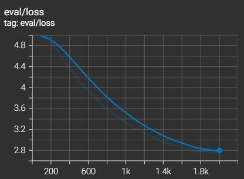

# Pokemon Images Classification with Vision Transformer (ViT)


<p align="center">
    
</p>

## Project Overview
As the Transformers architecture scaled well in Natural Language Processing, the same architecture was applied to images by creating small patches of the image and treating them as tokens. The result was a Vision Transformer (ViT). 

This project leverage `datasets` to download and process [pokemon image classification dataset](https://huggingface.co/datasets/fcakyon/pokemon-classification), and then use them to fine-tune a pre-trained ViT. 

|
:------------------: |
Vision Transformer (ViT) Architecture

Read more on the Vision Transformer (ViT) model from this paper: [An Image is Worth 16x16 Words: Transformers for Image Recognition at Scale](https://arxiv.org/abs/2010.11929) 
### Authors:
- Github: [Dungfx15018](https://github.com/Dungfx15018) and [EveTLynn](https://github.com/EveTLynn)
- Email: dungtrandinh513@gmail.com and linhtong1201@gmail.com

### Advisors:
- Github: [bangoc123](https://github.com/bangoc123)
- Email: protonxai@gmail.com

## I.  Set up environment
- Step 1: Create a Python virtual environment

```shell
python -m venv {your_venv_name}
```

- Step 2: Activate the virtual environment
```shell
.\{your_venv_name}\Scripts\activate 
```

- Step 3: Install dependencies

```shell
pip install -r requirements.txt
``` 

## II.  Set up your dataset

- This project makes use of [pokemon-classification dataset](https://huggingface.co/datasets/fcakyon/pokemon-classification) from Hugging Face which  includes 6991 images. Pokemon are annotated in folder format.
- The dataset can be easily loaded using `datasets.load_dataset` function

## III. Training Process
Training script:


```shell
python train.py --batch-size ${batch-size} --learning-rate ${learning-rate} --num-train-epochs ${num-train-epochs}
```

Example:

```shell
python train.py --batch-size 16 --learning-rate 2e-5 --num-train-epochs 10
``` 

There are some important arguments for the script you should consider when running it:

- `batch-size`: Specifies the size of each batch of data during training.
- `learning-rate`: Sets the learning rate for the training process, controlling the step size during optimization.
- `num-train-epochs`: Determines the number of complete passes through the entire training dataset during training.

## IV. Predict Process

```shell
!python predict.py --dir-model 'pokemon_models/checkpoint-1610' --image-path '0cfe57a5bf674650b0de0c381df13ca0_jpg.rf.cf29339aa61d57131478f066ba7cceba.jpg'  --checkpoint  'google/vit-base-patch16-224-in21k' --data-dir 'fcakyon/pokemon-classification'  --test-size 0.2 

[{'score': 0.7122378349304199, 'label': 'Alakazam'}, {'score': 0.03247630596160889, 'label': 'Kadabra'}, {'score': 0.0074781812727451324, 'label': 'Abra'}, {'score': 0.0038069335278123617, 'label': 'Farfetchd'}, {'score': 0.0037275038193911314, 'label': 'Beedrill'}]

```

## V. Result and Comparision


```
***** train metrics *****
  epoch                    =      22.8571
  total_flos               = 9237299936GF
  train_loss               =       3.4517
  train_runtime            =   1:20:27.19
  train_samples_per_second =       26.516
  train_steps_per_second   =        0.414

***** eval metrics *****
  epoch                   =    22.8571
  eval_accuracy           =     0.8499
  eval_loss               =     2.7948
  eval_runtime            = 0:00:18.49
  eval_samples_per_second =     75.625
  eval_steps_per_second   =      4.757

```

The evaluation accuracy peaked at step 1750 with a value of 87.78%, then started to decline. The loss for both training and evaluation continued to decrease. It suggests that the model's performance may improve with additional training steps. However, the training loss is higher than the evaluation loss, suggesting that the model might be overfitting to the training data.

 |  | |
:------------------: | :------------------: | :------------------:|
Training Loss |  Evaluation Accuracy | Evaluation Loss

Train and see the evaluation metrics with Tensorboard on [Colab.](https://colab.research.google.com/drive/15SIDudaiztH6OEPqnVM1_6GOUC6pFROy#scrollTo=KlG6mWsWTz8O)

<!--
**FIXME**

Other architecture

```
Epoch 6/10
391/391 [==============================] - 115s 292ms/step - loss: 0.1999 - acc: 0.9277 - val_loss: 0.4719 - val_acc: 0.8130
Epoch 7/10
391/391 [==============================] - 114s 291ms/step - loss: 0.1526 - acc: 0.9494 - val_loss: 0.5224 - val_acc: 0.8318
Epoch 8/10
391/391 [==============================] - 115s 293ms/step - loss: 0.1441 - acc: 0.9513 - val_loss: 0.5811 - val_acc: 0.7875
```

Your comments about these results <--- **FIXME**

<!--
## VI. Running Test

When you want to modify the model, you need to run the test to make sure your change does not affect the whole system.

In the `./folder-name` **(FIXME)** folder please run:

```bash
pytest
```
-->